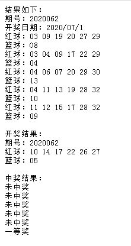

# UtilPHP
PHP相关的一些工具

* * *
### captcha 验证码生成工具类
* 验证码字符默认支持大小写英文字母及数字，支持自定义字符
* 支持保存生成的验证码图像
* 支持自定义验证码位数、干扰点个数、干扰线条数
* 字体默认支持喵体、方正兰亭超细黑简体字体 常规、方正粗圆简体、方正字迹-百乐硬笔简体、汉仪粗篆繁，其他字体可自行扩充或禁用
* 默认字体颜色比其他颜色深约70%，可自行设置

* * *
### ChinaWelfareLottery 中国福利彩票相关工具

##### DoubleChromosphere 

* 双色球彩票图像文字识别（借用百度开发者平台文字识别相关接口实现）
* 支持获取彩票图像中的期号、开奖日期及红蓝球组合列表
##### DoubleChromospereWinning

* 支持按期号获取双色球的开奖信息
* 支持获取最新一期双色球的开奖信息
* 支持批量获取多期双色球的开奖信息
##### Redemption

* 支持依据给定购买的双色球红蓝组合和开奖的红蓝组合识别所中的奖项（自动兑奖）

